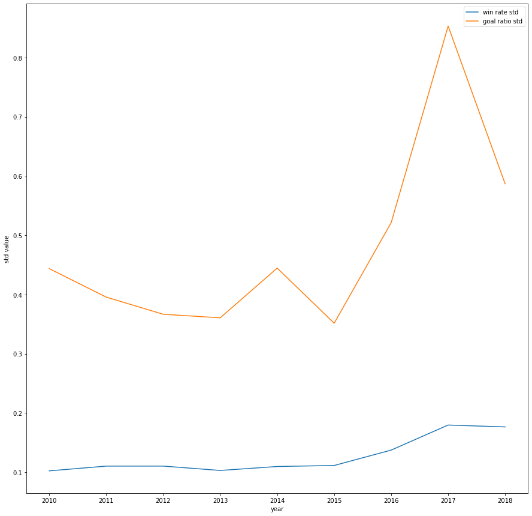

# Analyzing Football Clubs in the U.K. ¶
## by Feng Gu

## Introduction
### The objective of this data science project is evaluating the performance of football clubs in the U.K. from 2010 to 2019 and hopefully getting insights on the general trends of British and Wales football. This tutorial will try to discover patterns hiding in plain sight. The football clubs are selected from the Premier League, the EFL League One, etc. The football data used in this tutorial can be found [here](https://github.com/footballcsv/england), under the 2010s folder.
## Required Libraries
### pandas (data manipulation) <br /> Regular Expression (processing data) <br /> matplotlib (plotting graphs) <br /> scikit-learn (machine learning) <br /> numpy (calculation)


```python
import pandas as pd
import re
from matplotlib import pyplot as plt
from sklearn import linear_model
from sklearn.preprocessing import PolynomialFeatures
import numpy as np
import warnings
from pandas.core.common import SettingWithCopyWarning
warnings.simplefilter(action="ignore", category=SettingWithCopyWarning)
```

## Data collection
### This is the process where we gather the information from GitHub and put it in a pandas [DataFrame](https://pandas.pydata.org/pandas-docs/stable/reference/api/pandas.DataFrame.html). A DataFrame is a 2-dimentional table in which we store our data. The DataFrame allows us to extract and filter data whenever we need. The [GitHub repository](https://github.com/footballcsv/england) provides an archive file consisting of csv tables. 
### For convenience purposes, I renamed the csv tables (to '10.csv', '11.csv', etc.) after unzipping the archived file. We use the read\_csv() function in pandas to read the csv tables and put them in a list sequentially. We print out the content of the first file to give you a general idea. Each line represents a football match, containing the competing teams, score, date, and round, as you can see below.


```python
frames = []
list = ['10.csv', '11.csv', '12.csv', '13.csv', '14.csv', '15.csv', '16.csv', '17.csv', '18.csv', '19.csv']
for file in list:
    data = pd.read_csv(file, sep=',')
    frames.append(data)
    if file == '10.csv':
        print(data)  
```

          Round             Date                      Team 1   FT  \
    0         1  Sat Aug 14 2010         Bolton Wanderers FC  0-0   
    1         1  Sat Aug 14 2010           Wigan Athletic FC  0-4   
    2         1  Sat Aug 14 2010              Aston Villa FC  3-0   
    3         1  Sat Aug 14 2010  Wolverhampton Wanderers FC  2-1   
    4         1  Sat Aug 14 2010              Sunderland AFC  2-2   
    ...     ...              ...                         ...  ...   
    2031     46   Sat May 7 2011           Leicester City FC  4-2   
    2032     46   Sat May 7 2011           Crystal Palace FC  0-3   
    2033     46   Sat May 7 2011                  Burnley FC  1-1   
    2034     46   Sat May 7 2011             Bristol City FC  3-0   
    2035     46   Sat May 7 2011                 Barnsley FC  1-0   
    
                        Team 2  
    0                Fulham FC  
    1             Blackpool FC  
    2       West Ham United FC  
    3            Stoke City FC  
    4       Birmingham City FC  
    ...                    ...  
    2031       Ipswich Town FC  
    2032  Nottingham Forest FC  
    2033       Cardiff City FC  
    2034         Hull City AFC  
    2035           Millwall FC  
    
    [2036 rows x 5 columns]


### Next, we need to combine data from each year. We can do so by using the concat() function in pandas. Now, we have a DataFrame containing all the information needed to do an analysis.


```python
data = pd.concat(frames, ignore_index=True)
data
```


<div>


    .dataframe tbody tr th {
        vertical-align: top;
    }

    .dataframe thead th {
        text-align: right;
    }
    
<table border="1" class="dataframe">
  <thead>
    <tr style="text-align: right;">
      <th></th>
      <th>Round</th>
      <th>Date</th>
      <th>Team 1</th>
      <th>FT</th>
      <th>Team 2</th>
    </tr>
  </thead>
  <tbody>
    <tr>
      <th>0</th>
      <td>1</td>
      <td>Sat Aug 14 2010</td>
      <td>Bolton Wanderers FC</td>
      <td>0-0</td>
      <td>Fulham FC</td>
    </tr>
    <tr>
      <th>1</th>
      <td>1</td>
      <td>Sat Aug 14 2010</td>
      <td>Wigan Athletic FC</td>
      <td>0-4</td>
      <td>Blackpool FC</td>
    </tr>
    <tr>
      <th>2</th>
      <td>1</td>
      <td>Sat Aug 14 2010</td>
      <td>Aston Villa FC</td>
      <td>3-0</td>
      <td>West Ham United FC</td>
    </tr>
    <tr>
      <th>3</th>
      <td>1</td>
      <td>Sat Aug 14 2010</td>
      <td>Wolverhampton Wanderers FC</td>
      <td>2-1</td>
      <td>Stoke City FC</td>
    </tr>
    <tr>
      <th>4</th>
      <td>1</td>
      <td>Sat Aug 14 2010</td>
      <td>Sunderland AFC</td>
      <td>2-2</td>
      <td>Birmingham City FC</td>
    </tr>
    <tr>
      <th>...</th>
      <td>...</td>
      <td>...</td>
      <td>...</td>
      <td>...</td>
      <td>...</td>
    </tr>
    <tr>
      <th>18405</th>
      <td>46</td>
      <td>Sat Apr 25 2020</td>
      <td>Hartlepool United FC</td>
      <td>NaN</td>
      <td>Torquay United FC</td>
    </tr>
    <tr>
      <th>18406</th>
      <td>46</td>
      <td>Sat Apr 25 2020</td>
      <td>Maidenhead United FC</td>
      <td>NaN</td>
      <td>Sutton United FC</td>
    </tr>
    <tr>
      <th>18407</th>
      <td>46</td>
      <td>Sat Apr 25 2020</td>
      <td>Notts County FC</td>
      <td>NaN</td>
      <td>Yeovil Town FC</td>
    </tr>
    <tr>
      <th>18408</th>
      <td>46</td>
      <td>Sat Apr 25 2020</td>
      <td>Solihull Moors FC</td>
      <td>NaN</td>
      <td>FC Halifax Town</td>
    </tr>
    <tr>
      <th>18409</th>
      <td>46</td>
      <td>Sat Apr 25 2020</td>
      <td>Stockport County FC</td>
      <td>NaN</td>
      <td>Wrexham AFC</td>
    </tr>
  </tbody>
</table>
<p>18410 rows × 5 columns</p>
</div>


## Data Processing
### There are a few things we need to do to tidy the data. <br /> 1. We notived that there are missing values in some rows. We need to remove them to improve accuracy. <br /> 2. We need to split the score from the FT column and find out the winning team. We can do so using regular expression <br /> 3. We can also ignore the round, month, and day because they are relatively insignificant in our quantitative analysis.


```python
# process data
data = data.dropna() # remove the rows with missing values
data['Team 1 goals'] = 0 # creating new columns to record the new information obtained
data['Team 2 goals'] = 0
data['winning team'] = ''
# iterate by rows
for idx, row in data.iterrows():
    date_regex = re.compile(r'(\d{4})') # the regular expression to find the year in the 'Date' column
    ft_regex = re.compile(r'(\d)') # the regular expression to find the scores in the 'FT' column
    s1, s2 = re.findall(ft_regex, row['FT']) # s1 represents the score for team 1, s2 for team 2
    year = re.findall(date_regex, row['Date']) # find the year in the 'Date' column
    # putting the values in the new columns
    data.at[idx, 'Team 1 goals'] = s1 
    data.at[idx, 'Team 2 goals'] = s2
    # remove month and day from date
    data.at[idx, 'Date'] = int(year[0])
    # find the winning team
    if s1 > s2:
        data.at[idx, 'winning team'] = row['Team 1']
    elif s2 > s1:
        data.at[idx, 'winning team'] = row['Team 2']
    else:
        data.at[idx, 'winning team'] = 'draw'
# remove the 'Round' and 'FT' since they are no longer useful
data = data.drop(columns=['Round', 'FT'])  
data
```


<div>


    .dataframe tbody tr th {
        vertical-align: top;
    }

    .dataframe thead th {
        text-align: right;
    }
    
<table border="1" class="dataframe">
  <thead>
    <tr style="text-align: right;">
      <th></th>
      <th>Date</th>
      <th>Team 1</th>
      <th>Team 2</th>
      <th>Team 1 goals</th>
      <th>Team 2 goals</th>
      <th>winning team</th>
    </tr>
  </thead>
  <tbody>
    <tr>
      <th>0</th>
      <td>2010</td>
      <td>Bolton Wanderers FC</td>
      <td>Fulham FC</td>
      <td>0</td>
      <td>0</td>
      <td>draw</td>
    </tr>
    <tr>
      <th>1</th>
      <td>2010</td>
      <td>Wigan Athletic FC</td>
      <td>Blackpool FC</td>
      <td>0</td>
      <td>4</td>
      <td>Blackpool FC</td>
    </tr>
    <tr>
      <th>2</th>
      <td>2010</td>
      <td>Aston Villa FC</td>
      <td>West Ham United FC</td>
      <td>3</td>
      <td>0</td>
      <td>Aston Villa FC</td>
    </tr>
    <tr>
      <th>3</th>
      <td>2010</td>
      <td>Wolverhampton Wanderers FC</td>
      <td>Stoke City FC</td>
      <td>2</td>
      <td>1</td>
      <td>Wolverhampton Wanderers FC</td>
    </tr>
    <tr>
      <th>4</th>
      <td>2010</td>
      <td>Sunderland AFC</td>
      <td>Birmingham City FC</td>
      <td>2</td>
      <td>2</td>
      <td>draw</td>
    </tr>
    <tr>
      <th>...</th>
      <td>...</td>
      <td>...</td>
      <td>...</td>
      <td>...</td>
      <td>...</td>
      <td>...</td>
    </tr>
    <tr>
      <th>18306</th>
      <td>2020</td>
      <td>Dover Athletic FC</td>
      <td>Chesterfield FC</td>
      <td>1</td>
      <td>1</td>
      <td>draw</td>
    </tr>
    <tr>
      <th>18307</th>
      <td>2020</td>
      <td>Sutton United FC</td>
      <td>Hartlepool United FC</td>
      <td>1</td>
      <td>1</td>
      <td>draw</td>
    </tr>
    <tr>
      <th>18309</th>
      <td>2020</td>
      <td>Notts County FC</td>
      <td>Eastleigh FC</td>
      <td>4</td>
      <td>0</td>
      <td>Notts County FC</td>
    </tr>
    <tr>
      <th>18310</th>
      <td>2020</td>
      <td>Maidenhead United FC</td>
      <td>Stockport County FC</td>
      <td>1</td>
      <td>2</td>
      <td>Stockport County FC</td>
    </tr>
    <tr>
      <th>18313</th>
      <td>2020</td>
      <td>AFC Fylde</td>
      <td>Aldershot Town FC</td>
      <td>1</td>
      <td>0</td>
      <td>AFC Fylde</td>
    </tr>
  </tbody>
</table>
<p>18029 rows × 6 columns</p>
</div>


### Now we have a better DataFrame. The next step is to format the data to gain information about each football club. Thus, we can create a new DataFrame with respect to the clubs instead of the football matches. We want to know how many goals they made, how many games they win, etc. from 2010 to 2019. To obtain a list of the clubs, we can just look at the Team 1 and Team 2 columns from our previous DataFrame. Notice that we use the drop_duplicates() function so that no club is listed multiple times. We have now created a template to record team standing information.


```python
# creates a stat table for teams
# create a list containing all the teams
teams1 = data['Team 1'].drop_duplicates().tolist()
teams2 = data['Team 2'].drop_duplicates().tolist()
teams1.extend(x for x in teams2 if x not in teams1)

# creates a new dataframe with the following columns
teams_db = pd.DataFrame(columns=['team', 'games', 'wins', 'losses', 'winrate', 'goals'])
teams_db['team'] = teams1 # initialize the teams
teams_db = teams_db.set_index('team') # set the teams as the index
# initializing all the numerical values
teams_db['games'] = 0
teams_db['wins'] = 0
teams_db['losses'] = 0
teams_db['draws'] = 0
teams_db['winrate'] = 0.0
teams_db['goals'] = 0
teams_db['opponent_goals'] = 0
teams_db['goal_ratio'] = 0.0
teams_db
```


<div>


    .dataframe tbody tr th {
        vertical-align: top;
    }

    .dataframe thead th {
        text-align: right;
    }

<table border="1" class="dataframe">
  <thead>
    <tr style="text-align: right;">
      <th></th>
      <th>games</th>
      <th>wins</th>
      <th>losses</th>
      <th>winrate</th>
      <th>goals</th>
      <th>draws</th>
      <th>opponent_goals</th>
      <th>goal_ratio</th>
    </tr>
    <tr>
      <th>team</th>
      <th></th>
      <th></th>
      <th></th>
      <th></th>
      <th></th>
      <th></th>
      <th></th>
      <th></th>
    </tr>
  </thead>
  <tbody>
    <tr>
      <th>Bolton Wanderers FC</th>
      <td>0</td>
      <td>0</td>
      <td>0</td>
      <td>0.0</td>
      <td>0</td>
      <td>0</td>
      <td>0</td>
      <td>0.0</td>
    </tr>
    <tr>
      <th>Wigan Athletic FC</th>
      <td>0</td>
      <td>0</td>
      <td>0</td>
      <td>0.0</td>
      <td>0</td>
      <td>0</td>
      <td>0</td>
      <td>0.0</td>
    </tr>
    <tr>
      <th>Aston Villa FC</th>
      <td>0</td>
      <td>0</td>
      <td>0</td>
      <td>0.0</td>
      <td>0</td>
      <td>0</td>
      <td>0</td>
      <td>0.0</td>
    </tr>
    <tr>
      <th>Wolverhampton Wanderers FC</th>
      <td>0</td>
      <td>0</td>
      <td>0</td>
      <td>0.0</td>
      <td>0</td>
      <td>0</td>
      <td>0</td>
      <td>0.0</td>
    </tr>
    <tr>
      <th>Sunderland AFC</th>
      <td>0</td>
      <td>0</td>
      <td>0</td>
      <td>0.0</td>
      <td>0</td>
      <td>0</td>
      <td>0</td>
      <td>0.0</td>
    </tr>
    <tr>
      <th>...</th>
      <td>...</td>
      <td>...</td>
      <td>...</td>
      <td>...</td>
      <td>...</td>
      <td>...</td>
      <td>...</td>
      <td>...</td>
    </tr>
    <tr>
      <th>Maldon &amp; Tiptree FC</th>
      <td>0</td>
      <td>0</td>
      <td>0</td>
      <td>0.0</td>
      <td>0</td>
      <td>0</td>
      <td>0</td>
      <td>0.0</td>
    </tr>
    <tr>
      <th>Kingstonian FC</th>
      <td>0</td>
      <td>0</td>
      <td>0</td>
      <td>0.0</td>
      <td>0</td>
      <td>0</td>
      <td>0</td>
      <td>0.0</td>
    </tr>
    <tr>
      <th>Boston United FC</th>
      <td>0</td>
      <td>0</td>
      <td>0</td>
      <td>0.0</td>
      <td>0</td>
      <td>0</td>
      <td>0</td>
      <td>0.0</td>
    </tr>
    <tr>
      <th>Altrincham FC</th>
      <td>0</td>
      <td>0</td>
      <td>0</td>
      <td>0.0</td>
      <td>0</td>
      <td>0</td>
      <td>0</td>
      <td>0.0</td>
    </tr>
    <tr>
      <th>Chichester City FC</th>
      <td>0</td>
      <td>0</td>
      <td>0</td>
      <td>0.0</td>
      <td>0</td>
      <td>0</td>
      <td>0</td>
      <td>0.0</td>
    </tr>
  </tbody>
</table>
<p>145 rows × 8 columns</p>
</div>


### For every year between 2010 and 2019 (inclusive), we record the team standing and calculate the win rate and goal ratio. Note that we dropped rows with games = 0  or missing values (NaN). We also need to calculate the win rate and the goal ratio for each team as the match data is recorded. We can use the following formula to calculate the win rate: <br /> winrate = wins / games (the greater the better), and the goal_ratio using: <br /> goal ratio = goals / opponent goals (the greater the better) <br /> 


```python
team_standing_by_year = []
for year in range(2010,2020): # iterate over year
    temp = teams_db.copy() # create a copy of the empty table
    for idx, row in data.iterrows():
        if row['Date'] == year: # check the year value is correct
            team1 = row['Team 1']
            team2 = row['Team 2']
            wt = row['winning team']
            # increment the corresponding game and goal value in the new dataframe
            temp.loc[[team1, team2], ['games']] += 1
            temp.loc[[team1], ['goals']] += row['Team 1 goals']
            temp.loc[[team1], ['opponent_goals']] += row['Team 2 goals']
            temp.loc[[team2], ['goals']] += row['Team 2 goals']
            temp.loc[[team2], ['opponent_goals']] += row['Team 1 goals']
            # check for the winning and losing team and update the value
            if wt == 'draw':
                temp.loc[[team1, team2], ['draws']] += 1
            elif wt == team1:
                temp.loc[[team1], ['wins']] += 1
                temp.loc[[team2], ['losses']] += 1
            else:
                temp.loc[[team2], ['wins']] += 1
                temp.loc[[team1], ['losses']] += 1
    temp = temp.dropna() # drop teams with missing values
    temp_filtered = temp[temp['games'] > 0]  # drop teams with 0 games
    team_standing_by_year.append(temp_filtered) # put the dataframe in a list
    
for standing in team_standing_by_year:
    for idx,row in standing.iterrows():
        if row['games'] > 0:
            wr = row['wins'] / row['games'] # calculating win rate
            standing.at[idx, 'winrate'] = wr
        if row['opponent_goals'] > 0:
            gr = row['goals'] / row['opponent_goals'] # calculating goal ratio
            standing.at[idx, 'goal_ratio'] = gr
```

### team_standing_by_year now has the data separated by year. We create a new DataFrame containing data from 2010 to 2019. That is, adding all the data together.


```python
for idx, row in data.iterrows():
    # getting teams that are playing and winning
    team1 = row['Team 1']
    team2 = row['Team 2']
    wt = row['winning team']
    # increment the corresponding game and goal value in the new dataframe
    teams_db.loc[[team1, team2], ['games']] += 1
    teams_db.loc[[team1], ['goals']] += row['Team 1 goals']
    teams_db.loc[[team1], ['opponent_goals']] += row['Team 2 goals']
    teams_db.loc[[team2], ['goals']] += row['Team 2 goals']
    teams_db.loc[[team2], ['opponent_goals']] += row['Team 1 goals']
    # check for the winning and losing team and update the value
    if wt == 'draw':
        teams_db.loc[[team1, team2], ['draws']] += 1
    elif wt == team1:
        teams_db.loc[[team1], ['wins']] += 1
        teams_db.loc[[team2], ['losses']] += 1
    else:
        teams_db.loc[[team2], ['wins']] += 1
        teams_db.loc[[team1], ['losses']] += 1
```


```python
# calculate winrate
for idx,row in teams_db.iterrows():
    wr = row['wins'] / row['games']
    gr = row['goals'] / row['opponent_goals']
    teams_db.at[idx, 'winrate'] = wr
    teams_db.at[idx, 'goal_ratio'] = gr
teams_db    
```


<div>


    .dataframe tbody tr th {
        vertical-align: top;
    }

    .dataframe thead th {
        text-align: right;
    }

<table border="1" class="dataframe">
  <thead>
    <tr style="text-align: right;">
      <th></th>
      <th>games</th>
      <th>wins</th>
      <th>losses</th>
      <th>winrate</th>
      <th>goals</th>
      <th>draws</th>
      <th>opponent_goals</th>
      <th>goal_ratio</th>
    </tr>
    <tr>
      <th>team</th>
      <th></th>
      <th></th>
      <th></th>
      <th></th>
      <th></th>
      <th></th>
      <th></th>
      <th></th>
    </tr>
  </thead>
  <tbody>
    <tr>
      <th>Bolton Wanderers FC</th>
      <td>342</td>
      <td>86</td>
      <td>163</td>
      <td>0.251462</td>
      <td>383</td>
      <td>93</td>
      <td>550</td>
      <td>0.696364</td>
    </tr>
    <tr>
      <th>Wigan Athletic FC</th>
      <td>341</td>
      <td>109</td>
      <td>137</td>
      <td>0.319648</td>
      <td>407</td>
      <td>95</td>
      <td>473</td>
      <td>0.860465</td>
    </tr>
    <tr>
      <th>Aston Villa FC</th>
      <td>314</td>
      <td>81</td>
      <td>145</td>
      <td>0.257962</td>
      <td>353</td>
      <td>88</td>
      <td>508</td>
      <td>0.694882</td>
    </tr>
    <tr>
      <th>Wolverhampton Wanderers FC</th>
      <td>344</td>
      <td>132</td>
      <td>122</td>
      <td>0.383721</td>
      <td>463</td>
      <td>90</td>
      <td>457</td>
      <td>1.013129</td>
    </tr>
    <tr>
      <th>Sunderland AFC</th>
      <td>353</td>
      <td>103</td>
      <td>139</td>
      <td>0.291785</td>
      <td>412</td>
      <td>111</td>
      <td>483</td>
      <td>0.853002</td>
    </tr>
    <tr>
      <th>...</th>
      <td>...</td>
      <td>...</td>
      <td>...</td>
      <td>...</td>
      <td>...</td>
      <td>...</td>
      <td>...</td>
      <td>...</td>
    </tr>
    <tr>
      <th>Maldon &amp; Tiptree FC</th>
      <td>2</td>
      <td>1</td>
      <td>1</td>
      <td>0.500000</td>
      <td>2</td>
      <td>0</td>
      <td>2</td>
      <td>1.000000</td>
    </tr>
    <tr>
      <th>Kingstonian FC</th>
      <td>2</td>
      <td>1</td>
      <td>1</td>
      <td>0.500000</td>
      <td>4</td>
      <td>0</td>
      <td>2</td>
      <td>2.000000</td>
    </tr>
    <tr>
      <th>Boston United FC</th>
      <td>3</td>
      <td>1</td>
      <td>1</td>
      <td>0.333333</td>
      <td>5</td>
      <td>1</td>
      <td>3</td>
      <td>1.666667</td>
    </tr>
    <tr>
      <th>Altrincham FC</th>
      <td>2</td>
      <td>1</td>
      <td>1</td>
      <td>0.500000</td>
      <td>2</td>
      <td>0</td>
      <td>2</td>
      <td>1.000000</td>
    </tr>
    <tr>
      <th>Chichester City FC</th>
      <td>1</td>
      <td>0</td>
      <td>1</td>
      <td>0.000000</td>
      <td>1</td>
      <td>0</td>
      <td>5</td>
      <td>0.200000</td>
    </tr>
  </tbody>
</table>
<p>145 rows × 8 columns</p>
</div>


### Now, we noticed that there are teams with inadequate data. Let's filter out teams with games < 30 to maintain data integrity. Data processing is now finished.


```python
# filter teams using games
team_filtered = teams_db[teams_db['games'] >= 30] 
team_filtered
```


<div>


    .dataframe tbody tr th {
        vertical-align: top;
    }

    .dataframe thead th {
        text-align: right;
    }

<table border="1" class="dataframe">
  <thead>
    <tr style="text-align: right;">
      <th></th>
      <th>games</th>
      <th>wins</th>
      <th>losses</th>
      <th>winrate</th>
      <th>goals</th>
      <th>draws</th>
      <th>opponent_goals</th>
      <th>goal_ratio</th>
    </tr>
    <tr>
      <th>team</th>
      <th></th>
      <th></th>
      <th></th>
      <th></th>
      <th></th>
      <th></th>
      <th></th>
      <th></th>
    </tr>
  </thead>
  <tbody>
    <tr>
      <th>Bolton Wanderers FC</th>
      <td>342</td>
      <td>86</td>
      <td>163</td>
      <td>0.251462</td>
      <td>383</td>
      <td>93</td>
      <td>550</td>
      <td>0.696364</td>
    </tr>
    <tr>
      <th>Wigan Athletic FC</th>
      <td>341</td>
      <td>109</td>
      <td>137</td>
      <td>0.319648</td>
      <td>407</td>
      <td>95</td>
      <td>473</td>
      <td>0.860465</td>
    </tr>
    <tr>
      <th>Aston Villa FC</th>
      <td>314</td>
      <td>81</td>
      <td>145</td>
      <td>0.257962</td>
      <td>353</td>
      <td>88</td>
      <td>508</td>
      <td>0.694882</td>
    </tr>
    <tr>
      <th>Wolverhampton Wanderers FC</th>
      <td>344</td>
      <td>132</td>
      <td>122</td>
      <td>0.383721</td>
      <td>463</td>
      <td>90</td>
      <td>457</td>
      <td>1.013129</td>
    </tr>
    <tr>
      <th>Sunderland AFC</th>
      <td>353</td>
      <td>103</td>
      <td>139</td>
      <td>0.291785</td>
      <td>412</td>
      <td>111</td>
      <td>483</td>
      <td>0.853002</td>
    </tr>
    <tr>
      <th>...</th>
      <td>...</td>
      <td>...</td>
      <td>...</td>
      <td>...</td>
      <td>...</td>
      <td>...</td>
      <td>...</td>
      <td>...</td>
    </tr>
    <tr>
      <th>Dover Athletic FC</th>
      <td>87</td>
      <td>32</td>
      <td>34</td>
      <td>0.367816</td>
      <td>108</td>
      <td>21</td>
      <td>121</td>
      <td>0.892562</td>
    </tr>
    <tr>
      <th>Eastleigh FC</th>
      <td>87</td>
      <td>34</td>
      <td>30</td>
      <td>0.390805</td>
      <td>112</td>
      <td>23</td>
      <td>124</td>
      <td>0.903226</td>
    </tr>
    <tr>
      <th>Harrogate Town AFC</th>
      <td>84</td>
      <td>40</td>
      <td>24</td>
      <td>0.476190</td>
      <td>140</td>
      <td>20</td>
      <td>103</td>
      <td>1.359223</td>
    </tr>
    <tr>
      <th>Gateshead FC</th>
      <td>48</td>
      <td>19</td>
      <td>20</td>
      <td>0.395833</td>
      <td>54</td>
      <td>9</td>
      <td>52</td>
      <td>1.038462</td>
    </tr>
    <tr>
      <th>Havant &amp; Waterlooville FC</th>
      <td>46</td>
      <td>9</td>
      <td>24</td>
      <td>0.195652</td>
      <td>62</td>
      <td>13</td>
      <td>84</td>
      <td>0.738095</td>
    </tr>
  </tbody>
</table>
<p>122 rows × 8 columns</p>
</div>


## Exploratory Analysis and Data Visualization
### Remeber that our objective includes finding patterns from the data. To begin with, we can try to find the relationship between win rate and goal ratio. We can rearrange the rows by their win rate in the descending order using the sort_values() function:


```python
team_filtered.sort_values('winrate', ascending=False)
```


<div>


    .dataframe tbody tr th {
        vertical-align: top;
    }

    .dataframe thead th {
        text-align: right;
    }

<table border="1" class="dataframe">
  <thead>
    <tr style="text-align: right;">
      <th></th>
      <th>games</th>
      <th>wins</th>
      <th>losses</th>
      <th>winrate</th>
      <th>goals</th>
      <th>draws</th>
      <th>opponent_goals</th>
      <th>goal_ratio</th>
    </tr>
    <tr>
      <th>team</th>
      <th></th>
      <th></th>
      <th></th>
      <th></th>
      <th></th>
      <th></th>
      <th></th>
      <th></th>
    </tr>
  </thead>
  <tbody>
    <tr>
      <th>Manchester City FC</th>
      <td>391</td>
      <td>265</td>
      <td>65</td>
      <td>0.677749</td>
      <td>895</td>
      <td>61</td>
      <td>342</td>
      <td>2.616959</td>
    </tr>
    <tr>
      <th>Chelsea FC</th>
      <td>388</td>
      <td>223</td>
      <td>83</td>
      <td>0.574742</td>
      <td>706</td>
      <td>82</td>
      <td>398</td>
      <td>1.773869</td>
    </tr>
    <tr>
      <th>Manchester United FC</th>
      <td>390</td>
      <td>223</td>
      <td>76</td>
      <td>0.571795</td>
      <td>701</td>
      <td>91</td>
      <td>382</td>
      <td>1.835079</td>
    </tr>
    <tr>
      <th>Liverpool FC</th>
      <td>385</td>
      <td>214</td>
      <td>82</td>
      <td>0.555844</td>
      <td>734</td>
      <td>89</td>
      <td>416</td>
      <td>1.764423</td>
    </tr>
    <tr>
      <th>Arsenal FC</th>
      <td>387</td>
      <td>210</td>
      <td>89</td>
      <td>0.542636</td>
      <td>715</td>
      <td>88</td>
      <td>441</td>
      <td>1.621315</td>
    </tr>
    <tr>
      <th>...</th>
      <td>...</td>
      <td>...</td>
      <td>...</td>
      <td>...</td>
      <td>...</td>
      <td>...</td>
      <td>...</td>
      <td>...</td>
    </tr>
    <tr>
      <th>Hereford FC (2014-)</th>
      <td>92</td>
      <td>22</td>
      <td>39</td>
      <td>0.239130</td>
      <td>100</td>
      <td>31</td>
      <td>136</td>
      <td>0.735294</td>
    </tr>
    <tr>
      <th>Macclesfield Town FC</th>
      <td>177</td>
      <td>39</td>
      <td>83</td>
      <td>0.220339</td>
      <td>179</td>
      <td>55</td>
      <td>264</td>
      <td>0.678030</td>
    </tr>
    <tr>
      <th>Maidstone United FC</th>
      <td>50</td>
      <td>11</td>
      <td>32</td>
      <td>0.220000</td>
      <td>41</td>
      <td>7</td>
      <td>88</td>
      <td>0.465909</td>
    </tr>
    <tr>
      <th>Havant &amp; Waterlooville FC</th>
      <td>46</td>
      <td>9</td>
      <td>24</td>
      <td>0.195652</td>
      <td>62</td>
      <td>13</td>
      <td>84</td>
      <td>0.738095</td>
    </tr>
    <tr>
      <th>Chorley FC</th>
      <td>41</td>
      <td>4</td>
      <td>22</td>
      <td>0.097561</td>
      <td>33</td>
      <td>15</td>
      <td>75</td>
      <td>0.440000</td>
    </tr>
  </tbody>
</table>
<p>122 rows × 8 columns</p>
</div>


### And by goal ratio:


```python
team_filtered.sort_values('goal_ratio', ascending=False)
```


<div>


    .dataframe tbody tr th {
        vertical-align: top;
    }

    .dataframe thead th {
        text-align: right;
    }

<table border="1" class="dataframe">
  <thead>
    <tr style="text-align: right;">
      <th></th>
      <th>games</th>
      <th>wins</th>
      <th>losses</th>
      <th>winrate</th>
      <th>goals</th>
      <th>draws</th>
      <th>opponent_goals</th>
      <th>goal_ratio</th>
    </tr>
    <tr>
      <th>team</th>
      <th></th>
      <th></th>
      <th></th>
      <th></th>
      <th></th>
      <th></th>
      <th></th>
      <th></th>
    </tr>
  </thead>
  <tbody>
    <tr>
      <th>Manchester City FC</th>
      <td>391</td>
      <td>265</td>
      <td>65</td>
      <td>0.677749</td>
      <td>895</td>
      <td>61</td>
      <td>342</td>
      <td>2.616959</td>
    </tr>
    <tr>
      <th>Manchester United FC</th>
      <td>390</td>
      <td>223</td>
      <td>76</td>
      <td>0.571795</td>
      <td>701</td>
      <td>91</td>
      <td>382</td>
      <td>1.835079</td>
    </tr>
    <tr>
      <th>Chelsea FC</th>
      <td>388</td>
      <td>223</td>
      <td>83</td>
      <td>0.574742</td>
      <td>706</td>
      <td>82</td>
      <td>398</td>
      <td>1.773869</td>
    </tr>
    <tr>
      <th>Liverpool FC</th>
      <td>385</td>
      <td>214</td>
      <td>82</td>
      <td>0.555844</td>
      <td>734</td>
      <td>89</td>
      <td>416</td>
      <td>1.764423</td>
    </tr>
    <tr>
      <th>Arsenal FC</th>
      <td>387</td>
      <td>210</td>
      <td>89</td>
      <td>0.542636</td>
      <td>715</td>
      <td>88</td>
      <td>441</td>
      <td>1.621315</td>
    </tr>
    <tr>
      <th>...</th>
      <td>...</td>
      <td>...</td>
      <td>...</td>
      <td>...</td>
      <td>...</td>
      <td>...</td>
      <td>...</td>
      <td>...</td>
    </tr>
    <tr>
      <th>Stockport County FC</th>
      <td>87</td>
      <td>26</td>
      <td>37</td>
      <td>0.298851</td>
      <td>102</td>
      <td>24</td>
      <td>152</td>
      <td>0.671053</td>
    </tr>
    <tr>
      <th>Maidenhead United FC</th>
      <td>86</td>
      <td>28</td>
      <td>47</td>
      <td>0.325581</td>
      <td>90</td>
      <td>11</td>
      <td>135</td>
      <td>0.666667</td>
    </tr>
    <tr>
      <th>Braintree Town FC</th>
      <td>46</td>
      <td>11</td>
      <td>27</td>
      <td>0.239130</td>
      <td>48</td>
      <td>8</td>
      <td>78</td>
      <td>0.615385</td>
    </tr>
    <tr>
      <th>Maidstone United FC</th>
      <td>50</td>
      <td>11</td>
      <td>32</td>
      <td>0.220000</td>
      <td>41</td>
      <td>7</td>
      <td>88</td>
      <td>0.465909</td>
    </tr>
    <tr>
      <th>Chorley FC</th>
      <td>41</td>
      <td>4</td>
      <td>22</td>
      <td>0.097561</td>
      <td>33</td>
      <td>15</td>
      <td>75</td>
      <td>0.440000</td>
    </tr>
  </tbody>
</table>
<p>122 rows × 8 columns</p>
</div>


### It seems that the goal ratio is associated with the win rate: teams that appear in the first few rows in the former DataFrame also appear in the latter DataFrame. We hypothesize that the goal ratio is associated with win rate. In the next step, we want to see the performance of each team in the top 5 using matplotlib. For each team, we calculate its winrate in each year respectively using the aforementioned formula.


```python
fig= plt.figure(figsize=(15,15))
years = [2010, 2011, 2012, 2013, 2014, 2015, 2016, 2017, 2018, 2019]
mc = []
mu = []
cfc = []
lfc = []
afc = []
for standing in team_standing_by_year:
    mc.append(standing.loc['Manchester City FC', 'winrate'])
    mu.append(standing.loc['Manchester United FC', 'winrate'])
    cfc.append(standing.loc['Chelsea FC', 'winrate'])
    lfc.append(standing.loc['Liverpool FC', 'winrate'])
    afc.append(standing.loc['Arsenal FC', 'winrate'])
    
plt.plot(years, mc, label='Man City')
plt.plot(years, mu, label ='Man U')
plt.plot(years, cfc, label='Chelsea')
plt.plot(years, lfc, label='Liverpool')
plt.plot(years, afc, label='Arsenal')
plt.axhline(y=0.5, color='black', linestyle='-', label = '50% win rate')
plt.legend()
plt.xlabel('year')
plt.ylabel('win rate')
plt.show()
```


### Obviously, the top teams are performing exceptionally well (given the 50% winrate line). Here, we can also plot the trend of standard deviation for win rate and goal ratio. We have to make sure there are no missing values so that the std() function from numpy would work.


```python
wr_std = []
gr_std = []
for standing in team_standing_by_year[:-1]:
    wrs = np.array(standing['winrate']) # getting the winrates
    wrs = wrs[~np.isnan(wrs)] # remove missing value
    wr_std.append(np.std(wrs)) # add to the list
    
    grs = np.array(standing['goal_ratio'])
    grs = grs[~np.isnan(grs)]
    gr_std.append(np.std(grs))

fig= plt.figure(figsize=(15,15))
years = [2010, 2011, 2012, 2013, 2014, 2015, 2016, 2017, 2018]
plt.plot(years, wr_std, label='win rate std')
plt.plot(years, gr_std, label='goal ratio std')
plt.legend()
plt.xlabel('year')
plt.ylabel('std value')
plt.show()
```





### The standard deviation for win rate maintains the same level over the decade. However, the standard deviation for goal ratio increased dramatically over the decade. This may indicate that the gap between top teams and bottom teams is increasing. However, the bottom teams are losing most games and already having a very low winrate, hence the little increase in the win rate standard deviation. [This](https://www.premierleague.com/tables) confirms the hypothesis: as of 12/20/2020, the bottom 5 teams has 7 wins in total, whereas the leading team, Liverpool F.C., has 9.

### We can do a more in-depth evaluation: scatter-plotting goal ratio on x-axis versus win rate on y-axis and find a trend using numpy's polyfit() function if we notice any correlation between them.


```python
fig= plt.figure(figsize=(15,15))
for idx, row in team_filtered.iterrows():
    plt.scatter(row['goal_ratio'], row['winrate'])

plt.xlabel('goal ratio')
plt.ylabel('win rate')
plt.show()
```


### From the graph, it is evident that they have an approximately linear relationship. Now, we plot the same graph with a fitted line. We can also print out the coefficient and the intercept of the fitted line. The null hypothesis (i.e., no correlation) is rejected.


```python
fig= plt.figure(figsize=(15,15))
for idx, row in team_filtered.iterrows():
    plt.scatter(row['goal_ratio'], row['winrate'])
x = team_filtered['goal_ratio']
y = team_filtered['winrate']
rl = []
# calculating params for the line
m, b = np.polyfit(x, y, 1)
for i in x:
    val = b + m * i
    rl.append(val)
plt.plot(x, rl) # plot the fitted line
plt.xlabel('goal ratio')
plt.ylabel('win rate')
plt.show()
print('The intercept is ' + str(b))
print('The coefficient is ' + str(m))
```


    The intercept is 0.09849898607609475
    The coefficient is 0.2602514809999917


### The intercept tells us that when the goal ratio for a team is 0 (i.e., no goal), the win rate is less than 10%; the coefficient tells us that for a unit increase in the goal ratio, there is a 0.26 unit increase in win rate. 
### Another way to visualize the data is using a histogram. We can use 50 buckets to see the distribution of the goal ratio.


```python
# plot a histogram
fig= plt.figure(figsize=(15,15))
x = team_filtered['goal_ratio'].to_numpy()
plt.hist(x, bins=50) # using 50 buckets
plt.gca().set(title='Goal Ratio Distribution Histogram', xlabel='Goal Ratio', ylabel='Frequency');
plt.show()
```


### We see that most of the team have a goal ratio ≈ 1. In Premier League where 20 teams compete, the bottom 3 teams are relegated. In a hypothetical Premier League with 122 teams, a teams needs to stay away from the bottom 122 * 3 / 20 ≈ 19 position to avoid being relegated. Let's do some slicing:


```python
team = team_filtered.sort_values('goal_ratio')
slice = team[18:20]
slice
```


<div>


    .dataframe tbody tr th {
        vertical-align: top;
    }

    .dataframe thead th {
        text-align: right;
    }

<table border="1" class="dataframe">
  <thead>
    <tr style="text-align: right;">
      <th></th>
      <th>games</th>
      <th>wins</th>
      <th>losses</th>
      <th>winrate</th>
      <th>goals</th>
      <th>draws</th>
      <th>opponent_goals</th>
      <th>goal_ratio</th>
    </tr>
    <tr>
      <th>team</th>
      <th></th>
      <th></th>
      <th></th>
      <th></th>
      <th></th>
      <th></th>
      <th></th>
      <th></th>
    </tr>
  </thead>
  <tbody>
    <tr>
      <th>Morecambe FC</th>
      <td>362</td>
      <td>105</td>
      <td>157</td>
      <td>0.290055</td>
      <td>436</td>
      <td>100</td>
      <td>533</td>
      <td>0.818011</td>
    </tr>
    <tr>
      <th>Scunthorpe United FC</th>
      <td>362</td>
      <td>113</td>
      <td>146</td>
      <td>0.312155</td>
      <td>437</td>
      <td>103</td>
      <td>530</td>
      <td>0.824528</td>
    </tr>
  </tbody>
</table>
</div>


### That is, in order to avoid being relegated, the hypothetical team only needs <br /> goal ratio ≈ 0.82 <br /> and <br /> win rate ≈ 30%

### Next, we will predict the performance of randomly selected teams.
## Predict the Performance Using Linear Regression
### The first step for predicting is split the data intro training and test set. We select the first 99 rows as our training data so that <br /> training set:test set ≈ 4:1


```python
# split to training and test set
train = team_filtered.iloc[:99,:]
test = team_filtered.iloc[100:,:]
```

### We then convert the data into numpy arrays for calculation purposes and use the [linear regression model](https://scikit-learn.org/stable/modules/generated/sklearn.linear_model.LinearRegression.html) from scikit-learn. We print out the coefficient and intercept. They are almost identical to the result we got from numpy's polyfit() function.


```python
train_X = train['goal_ratio'].to_numpy()
train_y = train['winrate'].to_numpy()
train_X = np.array([[h] for h in train_X])
reg = linear_model.LinearRegression().fit(train_X, train_y)
print('The coefficient is ' + str(reg.coef_[0]))
print('The intercept is ' + str(reg.intercept_))
```

    The coefficient is 0.25205978278244273
    The intercept is 0.10698243379116967


### We can judge the quality of the fit using scikit-learn's score() function. The score is not perfect but definitely not low either.


```python
# judge the quality of the fit
test_X = test['goal_ratio'].to_numpy()
test_y = test['winrate'].to_numpy()
test_X = np.array([[h] for h in test_X])
reg.score(test_X, test_y)
```


    0.7623100437481832


### However, the score does not give a direct feeling of the accuracy of our prediction. We can use visualization to help us by comparing the actual result and the predicted result on the same graph.


```python
predicted = reg.predict(test_X) # getting the predicted result
fig= plt.figure(figsize=(15,15))
# plot the results
plt.plot(predicted, label='Predicted')
plt.plot(test_y, label='Actual')
plt.ylabel('winrate')
plt.legend()
plt.show()
```


### Actually, we find that our prediction is, to a great extent, accurate! 
## Conclusion
### In this tutorial, we find out some interesting pattern about the win rate and the goal ratio: win rate of a team is linearly proportional to its goal ratio. We find out that the gap between different football clubs has incrased dramatically over the years. We also use linear regression to model the win rate of a few football clubs and get decent results. This allows us to approximate the win rate of any team with a high accuracy observing its goal ratio. If more detailed data is available, we can perhaps look into how players are affecting the team's win rate, and thus calculate their relative cost efficiency.
